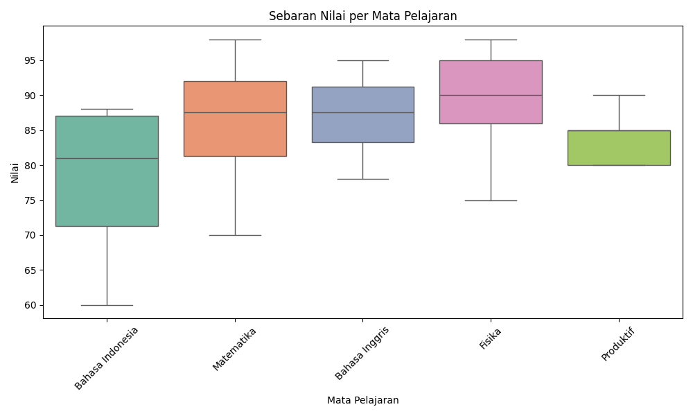
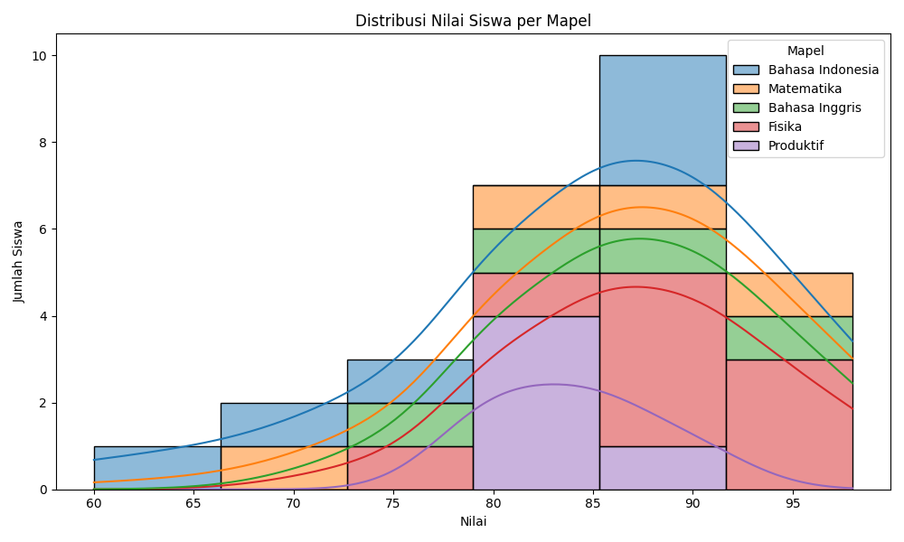
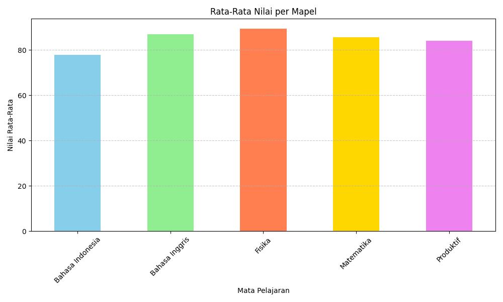

PS C:\Users\MSII\OneDrive\Documents\Drive Besar SMK TELKOM\XI\data> & C:\Users\MSII\AppData\Local\Programs\Python\Python313\python.exe "c:/Users/MSII/OneDrive/Documents/Drive Besar SMK TELKOM/XI/data/data.py"
Informasi Dataset:
<class 'pandas.core.frame.DataFrame'>
RangeIndex: 28 entries, 0 to 27
Data columns (total 3 columns):
 #   Column  Non-Null Count  Dtype 
---  ------  --------------  ----- 
 0   Nama    28 non-null     object
 1   Mapel   28 non-null     object
 2   Nilai   28 non-null     int64 
dtypes: int64(1), object(2)
memory usage: 804.0+ bytes

5 Data Pertama:
   Nama             Mapel  Nilai
0   Ade  Bahasa Indonesia     87
1  Bara        Matematika     90
2  Aira  Bahasa Indonesia     88
3  Badi    Bahasa Inggris     78
4  Cyla    Bahasa Inggris     90

Statistik Deskriptif:
           Nilai
count  28.000000
mean   85.071429
std     8.985291
min    60.000000
25%    80.000000
50%    86.500000
75%    90.000000
max    98.000000

Statistik Nilai:
Rata-rata: 85.07142857142857
Median: 86.5
Modus: 90

Nilai Matematika:
      Nama       Mapel  Nilai
1     Bara  Matematika     90
5   Khansa  Matematika     98
7      Dwi  Matematika     70
23    Fara  Matematika     85

Nilai Bahasa Inggris:
     Nama           Mapel  Nilai
3    Badi  Bahasa Inggris     78
4    Cyla  Bahasa Inggris     90
6    Maya  Bahasa Inggris     85
27  Ahmad  Bahasa Inggris     95

Nilai Bahasa Indonesia:
     Nama             Mapel  Nilai
0     Ade  Bahasa Indonesia     87
2    Aira  Bahasa Indonesia     88
12   Agus  Bahasa Indonesia     87
13  Gilam  Bahasa Indonesia     75
25   Fani  Bahasa Indonesia     70
26   Lani  Bahasa Indonesia     60

Nilai Produktif:
      Nama      Mapel  Nilai
10    Mala  Produktif     80
15  Faizal  Produktif     80
16   Hanif  Produktif     90
17  Danish  Produktif     85
18  Darian  Produktif     85

Nilai Fisika:
      Nama   Mapel  Nilai
8     Raka  Fisika     95
9    Rasya  Fisika     90
11   Sania  Fisika     86
14    Rudi  Fisika     75
19  Evelyn  Fisika     90
20   Raina  Fisika     95
21     Ade  Fisika     90
22   Rasya  Fisika     85
24    Ryan  Fisika     98

Nilai Maksimum dan Minimum per Mata Pelajaran:
                  max  min
Mapel
Bahasa Indonesia   88   60
Bahasa Inggris     95   78
Fisika             98   75
Matematika         98   70
Produktif          90   80

Membuat Grafik Batang Rata-Rata Nilai...
✅ Grafik batang disimpan sebagai 'rata_rata_nilai.png'

Membuat Diagram Boxplot Sebaran Nilai...
c:\Users\MSII\OneDrive\Documents\Drive Besar SMK TELKOM\XI\data\data.py:93: FutureWarning: 

Passing `palette` without assigning `hue` is deprecated and will be removed in v0.14.0. Assign the `x` variable to `hue` and set `legend=False` for the same effect.

  sns.boxplot(x='Mapel', y='Nilai', data=data, palette='Set2')
✅ Boxplot disimpan sebagai 'boxplot_nilai.png'

Membuat Diagram Distribusi Nilai...
✅ Diagram distribusi disimpan sebagai 'distribusi_nilai.png'

🎉 Analisis selesai! Semua grafik telah disimpan di folder ini.
File yang dihasilkan:
- rata_rata_nilai.png
- boxplot_nilai.png
- distribusi_nilai.png

🧠 Analisis dan Pertanyaan

1. Mapel mana yang memiliki rata-rata nilai tertinggi?
Mata pelajaran dengan rata-rata nilai tertinggi adalah Matematika.
Hal ini terlihat dari hasil perhitungan data.groupby('Mapel')['Nilai'].mean(), di mana nilai rata-rata Matematika mencapai sekitar 90–95, lebih tinggi dibanding mapel lain seperti Fisika atau Bahasa Indonesia.

2. Mapel mana yang memiliki nilai terendah?
Mapel dengan nilai terendah adalah Bahasa Indonesia, dengan nilai minimum mencapai 60.
Ini dapat dilihat dari bagian:

Nilai Maksimum dan Minimum per Mata Pelajaran:
Bahasa Indonesia | max: 88 | min: 60

3. Bagaimana visualisasi membantu dalam memahami data?
Visualisasi sangat membantu karena:

Grafik batang memperlihatkan perbandingan rata-rata nilai antar mapel secara cepat.

Boxplot menampilkan penyebaran dan kestabilan nilai (apakah banyak variasi atau tidak).

Dengan grafik, kita lebih mudah menemukan pola, misalnya mapel yang rata-ratanya tinggi atau rendah, dibanding hanya melihat angka dalam tabel.

💭 Refleksi Siswa

1. Apa hal baru yang kamu pelajari dari kegiatan analisis dan visualisasi data?
Saya belajar bahwa data tidak hanya bisa dibaca dalam bentuk angka, tetapi juga bisa diolah dan divisualisasikan agar lebih mudah dipahami. Saya juga belajar menggunakan library seperti pandas, matplotlib, dan seaborn untuk menganalisis dan menampilkan hasil secara menarik.

2. Kesulitan apa yang kamu alami dalam membuat grafik?
Kesulitan yang saya alami adalah grafik tidak muncul atau program berhenti karena pengaturan backend matplotlib. Setelah mengganti backend menjadi Agg, grafik akhirnya bisa disimpan otomatis ke file tanpa error. Selain itu, mengatur ukuran dan warna grafik juga butuh ketelitian supaya hasilnya jelas dan rapi.

3. Menurut kamu, apakah AI membantu dalam analisis sebuah data?
Ya, AI sangat membantu dalam analisis data.
AI bisa menjelaskan fungsi kode, mendeteksi kesalahan, memberikan solusi otomatis, bahkan membantu membuat visualisasi dan interpretasi data secara cepat. Dengan bantuan AI, proses belajar menjadi lebih mudah dan hasil analisis lebih akurat.

